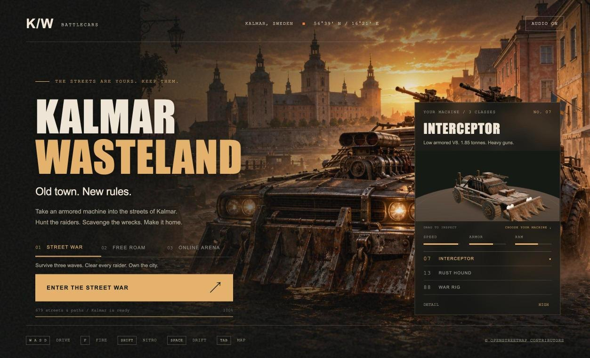
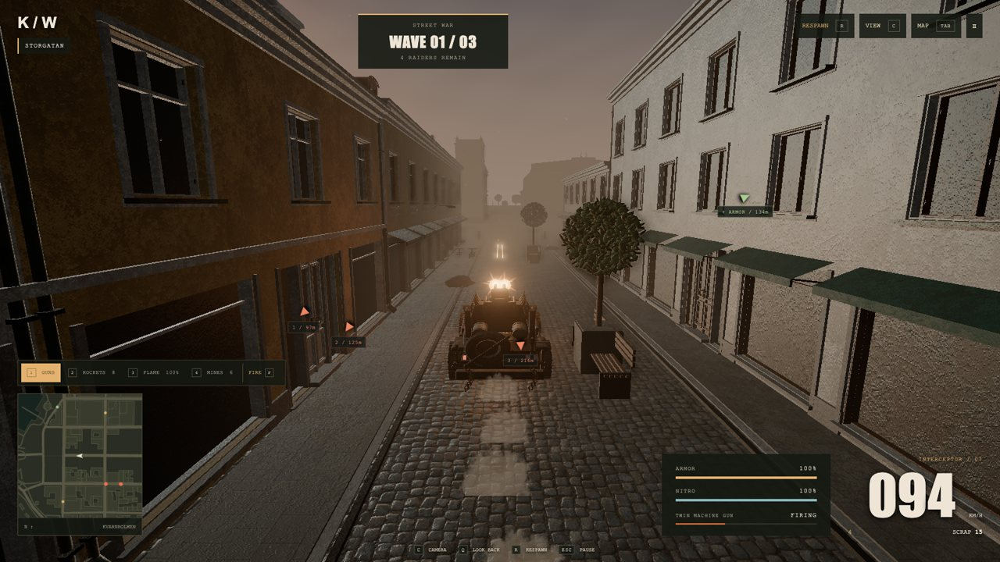
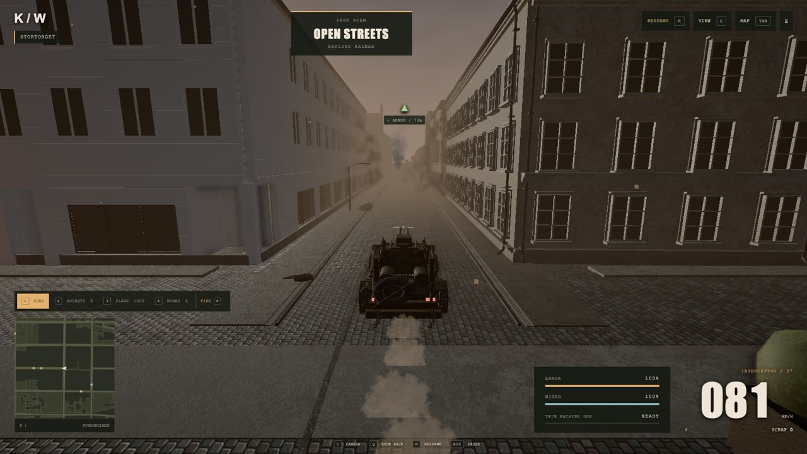
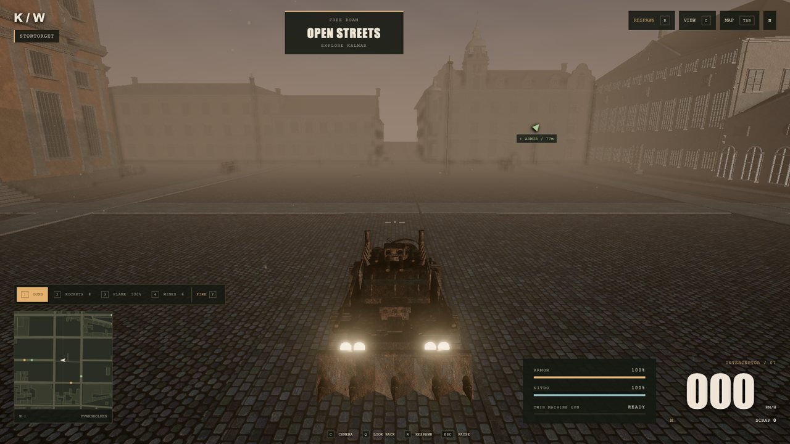
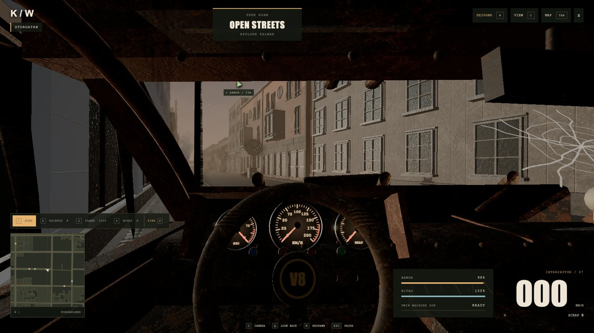
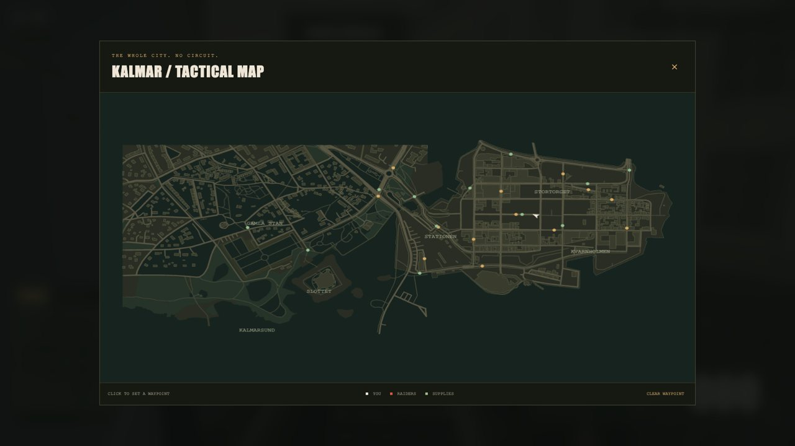
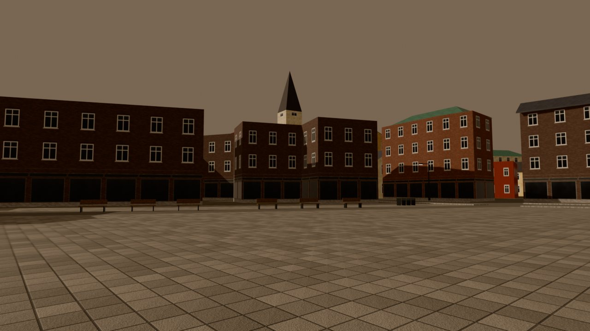
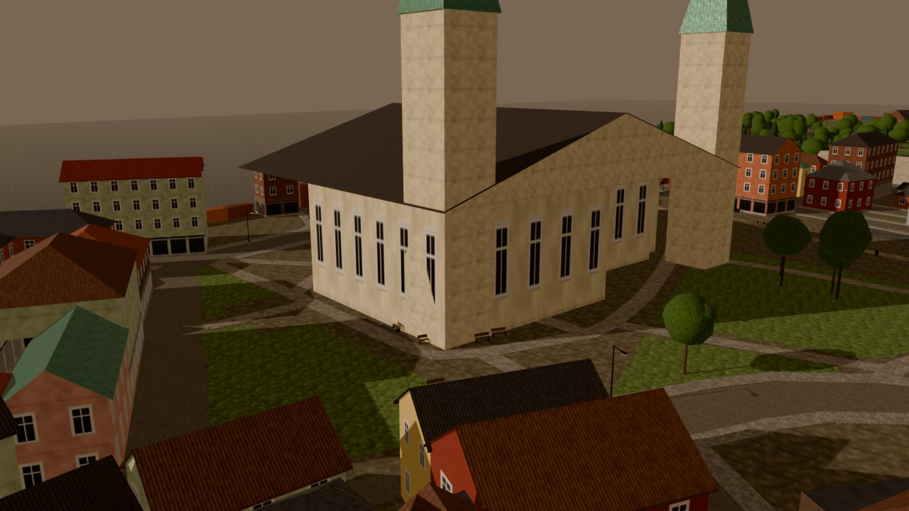

# Wasteland Builder

**Turn your town into a Mad Max battle-car game.** Name a place — a town, an old-town square, your
street — and an AI coding agent (Claude Code or Codex) builds it: real streets and buildings from
OpenStreetMap, an editable 3D city in Blender, and a browser game where armored cars fight raiders
through *your* streets. The title, splash screen, narrator and radio are made for the place.



*[Kalmar Wasteland](https://bjarby.com/kalmar-wasteland/) — the game this template was extracted from.
Its city went through more than 140 refinement rounds against Google Street View, photos and drawings
([kalmar-kvarnholmen](https://github.com/fltman/kalmar-kvarnholmen)). Your town starts from the
generator and gets there the same way, one street at a time.*

| | |
|---|---|
|  |  |
| Street War on Storgatan: raiders, awnings, trees, benches | Facades refined from Street View, house by house |
|  |  |
| Stortorget at dusk, looking back across the square | The driver's seat: dials, warning lamps, cracked glass |



*Screenshots from the published game at [bjarby.com/kalmar-wasteland](https://bjarby.com/kalmar-wasteland/).*

## Quick start

You need **Python 3.10+**, **Node.js 20+**, **Blender 4.2+** and ~2 GB of disk.

```sh
git clone https://github.com/fltman/wasteland-builder.git
cd wasteland-builder
```

Open the folder in **Claude Code** (`claude`) or **Codex** (`codex`) and just say what you want:

> Build Visby.  ·  Bygg Ystad, liten karta.  ·  Make a wasteland of Dubrovnik's old town and give it a theme song.

The agent checks your setup, finds the place, shows you the area, builds the city (a few minutes),
writes the game's title and texts with local landmarks, and starts the game at
**http://localhost:5220**. Ask for more afterwards: *"make the cathedral look right"*, *"refine
Strandgatan from Street View"*, *"give the narrator a Gotland accent"*, *"put it online so my friends
can play"*.

Without an agent, three commands do the same:

```sh
python3 wasteland.py doctor              # installs and checks everything (once)
python3 wasteland.py make "Visby"        # find → build → play
python3 wasteland.py make "Lund" --size small   # small 600 m · medium 1 km (default) · large 1.6 km
```

## What gets built

1. **Place** — OpenStreetMap search (Nominatim); a square play area around it.
2. **Map data** — buildings, streets, sidewalks, squares, parks, water and coast, trees, walls, lamps
   and benches from OpenStreetMap.
3. **City model** (`cities/<slug>/city.blend`) — every building extruded with storeys, window facades
   and roofs (gabled, hipped, flat with parapets; churches get towers); raised sidewalks and kerbs,
   cobbles where the map says so, quay walls, bridges, trees, street furniture, rails, and a wall of
   rusty containers at the edge of the map. Heights, colours and materials come from OSM where mapped
   and from regional style presets (Nordic, brick north, Mediterranean …) where not.
4. **Game pack** — streamed 60 m tiles (a 1 km town is ~10–20 MB), the street graph for the AI,
   spawn point, map labels, supply drops.
5. **Theme** — title (*VISBY WASTELAND*), menu texts, narrator lines and prompts that name real
   landmarks and streets.

The game: three armored machines, machine guns, homing rockets, a flamethrower and mines, three waves of
raiders, free roam, and an **online arena** for up to eight friends.

## Refinement rounds: from generated to real

The generator gets the street plan and every building footprint right, because they come from
OpenStreetMap. Storeys, colours, roofs and facades are *estimated* where the map says nothing — fine
for a game, but not yet *your* town. Refinement rounds fix that from pictures, the same way the Kalmar
city above was built:

1. **Pick a street, a square or one landmark** — *"refine Strandgatan"*, *"make the cathedral look right"*.
2. **The agent looks at reality.** `python3 wasteland.py buildings <slug> --street "Strandgatan"` lists
   each house with what the generator guessed and a **Google Street View** link aimed at its facade.
   With browser access (Claude in Chrome, Codex's browser) the agent opens every view, plus the
   satellite view for roof shapes, and counts storeys, reads wall colours and materials, roof shapes,
   shopfronts, gables and towers.
3. **Your own pictures count too.** Put photos you took (or openly licensed ones, e.g. from Wikimedia
   Commons) in `cities/<slug>/references/` and say what they show; drawings and old postcards work as
   well. Local knowledge beats any camera: tell the agent what you know.
4. **Corrections, not guesswork.** Observations go into `cities/<slug>/overrides.json` — per building,
   for whole areas or for streets (cobbles, widths, sidewalks). Landmarks that need real shapes get a
   hand-written Blender model (`cities/<slug>/custom/<id>.py`,
   [example](docs/custom-building-example.py)).
5. **Rebuild and compare.** `python3 wasteland.py rebuild <slug>` (about a minute) and
   `python3 wasteland.py render <slug> --street "Strandgatan"` renders the street from the same
   viewpoints, so the agent can put its images next to Street View and iterate.
6. **Logged.** Every round is written to `cities/<slug>/refinements.md` (what changed, from which view
   or photo), so the next round — or the next person — continues where it stopped.

Street View is used only to look; no Google imagery is stored in the project or the game. The skill
behind this is [`refine-city`](.agents/skills/refine-city/SKILL.md).

| Straight from the generator (Visby, ~1 minute) | After a custom-model round (example church) |
|---|---|
|  |  |

## Make it yours

| | How | Needs |
|---|---|---|
| **Refinement rounds** from Google Street View, satellite views and your own photos (see above) | `refine-city` skill · `wasteland.py buildings / rebuild / render` | a browser tool for Street View |
| **Splash art** with your town's landmarks | `imagegen` skill | Codex (built in), or `OPENAI_API_KEY` / `OPENROUTER_API_KEY` |
| **Narrator** who names your town | `elevenlabs` skill · `wasteland.py voices` | `ELEVENLABS_API_KEY` |
| **Soundtrack** | `suno-music` skill · `wasteland.py music --add` | a Suno account (web), or any MP3 |
| **Online multiplayer** on a small VPS (e.g. Vultr) | `deploy-arena` skill · [game/deploy/README.md](game/deploy/README.md) | a server, a domain |

Keys go in `.env` (copy `.env.example`). Everything is optional: without keys the game uses generic
narrator lines, the bundled soundtrack and a Blender-rendered splash screen.

## Publish

```sh
python3 wasteland.py publish visby --arena wss://arena.example.com/ws
```
Upload `game/dist/` to any web host. The arena relay setup (Ubuntu VPS, nginx, Let's Encrypt) is one
command: see [game/deploy/README.md](game/deploy/README.md).

## How it works

```
place.py ─► fetch_osm.py ─► prepare_city.py ─► blender/build_city.py ─► blender/export_tiles.py ─► web/tiles.mjs ─► make_pack.py
Nominatim    OSM API +       Shapely: every      city.blend (editable)     raw GLB per 60 m tile      meshopt + WebP     map.json, config.json,
             Overpass        geometry decision                                                                         media → game/public/city
                             → city.json
```
See [AGENTS.md](AGENTS.md) for the layout and conventions, [game/README.md](game/README.md) for the
game and its city contract.

## På svenska

Klona repot, öppna mappen i Claude Code eller Codex och skriv till exempel *"Bygg Visby"*. Agenten
installerar det som behövs, hämtar kartdata från OpenStreetMap, bygger staden i Blender och startar
spelet på http://localhost:5220 med stadens namn, en egen startbild, berättarröst och musik.

Sedan gör ni **förbättringsrundor**: välj en gata, ett torg eller ett hus (*"förbättra Strandgatan"*).
Agenten öppnar Google Street View och satellitvyn för varje fasad, jämför med sina egna renderingar
från samma vinkel och rättar våningar, färger, material, tak och skyltfönster — eller modellerar
landmärken för hand i Blender. Egna foton (lägg dem i `cities/<ort>/references/`) och lokalkännedom
fungerar lika bra. Det är så staden i [Kalmar Wasteland](https://bjarby.com/kalmar-wasteland/) har
byggts upp, runda för runda. Be också om en server på t.ex. Vultr så att ni kan spela online tillsammans.

## Credits and licenses

- Game engine, vehicles and shared effects: from **Kalmar Wasteland**; the city generator is inspired by
  **kalmar-kvarnholmen** — both by Anders Bjarby.
- Map data © [OpenStreetMap contributors](https://www.openstreetmap.org/copyright), ODbL. Generated
  cities are derived databases: keep the attribution (the game shows it).
- Code: MIT ([LICENSE](LICENSE)). Bundled art, sounds and music: see [THIRD_PARTY.md](THIRD_PARTY.md).
- Built with Blender, three.js, three-mesh-bvh, glTF-Transform, meshoptimizer, Shapely, sharp and Vite.
